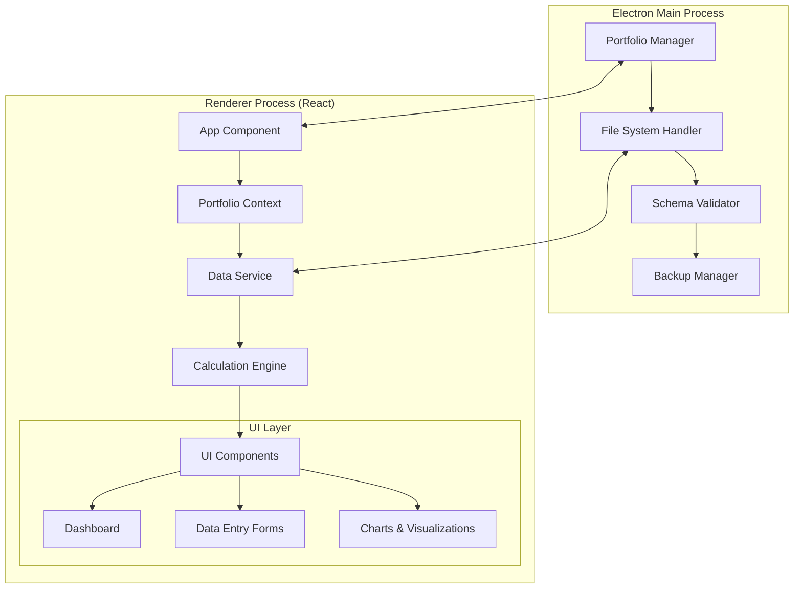

# Design Document

## Overview

Momentum is a desktop application built using Electron with a TypeScript/React frontend that enables manual net worth tracking through monthly financial snapshots. The application emphasizes simplicity, privacy, and motivation by storing data locally in user-selected portfolio folders using a Kubernetes-style JSON schema.

The architecture follows a clean separation between the Electron main process (file system operations, portfolio management) and the renderer process (React UI, calculations, visualizations). Data flows unidirectionally from the file system through the application state to the UI components.

## Architecture

### High-Level Architecture



### Technology Stack

- **Desktop Framework**: Electron 28+
- **Frontend**: React 18+ with TypeScript 5+
- **State Management**: React Context + useReducer for portfolio data
- **UI Framework**: Material-UI (MUI) v5+ for components and charts
- **Charts**: MUI X Charts for modern data visualizations
- **Styling**: Tailwind CSS for utility-first styling
- **Data Validation**: Zod for runtime schema validation
- **File Operations**: Node.js fs/promises for async file operations

### Process Communication

The main and renderer processes communicate via IPC (Inter-Process Communication):

- **Main → Renderer**: Portfolio data, file operation results, validation errors
- **Renderer → Main**: Save requests, portfolio selection, export/import operations

### Styling Architecture

The application uses a hybrid approach combining Material-UI components with Tailwind CSS:

- **Material-UI**: Provides pre-built components (Cards, Charts, Forms, Navigation)
- **Tailwind CSS**: Handles layout, spacing, colors, and custom styling
- **MUI Theme**: Custom theme configuration for consistent branding
- **Responsive Design**: Tailwind breakpoints for desktop-optimized layouts

## UI/UX Design System

### Design Philosophy

Momentum's design emphasizes **approachability** and **trustworthiness** as primary values. The interface should feel like a trusted financial dashboard with modern polish - calm, professional, and confidence-building without being overwhelming or flashy.

### Color Palette

#### Primary Colors (Trust & Stability)

```typescript
enum PrimaryColors {
  Navy = "#1E2A38", // Primary brand color
  MutedTeal = "#2A646D", // Secondary brand color
  SlateBlue = "#4A6072", // Tertiary brand color
}
```

#### Secondary Colors (Growth & Highlights)

```typescript
enum SecondaryColors {
  MutedGreen = "#4E7965", // Growth, positive trends
  WarmTaupe = "#A68C7C", // Soft accent
  BurntOrange = "#C76B43", // Sparingly for subtle highlights
}
```

#### Neutral Base (Backgrounds & Text)

```typescript
enum NeutralColors {
  OffWhite = "#F7F7F5", // Main background
  CoolGray = "#E3E4E8", // Cards, dividers
  Charcoal = "#2F2F2F", // Primary text
  MidGray = "#666666", // Secondary text
}
```

#### Feedback Colors (Signals)

```typescript
enum FeedbackColors {
  Positive = "#5BA77F", // Gains, positive changes
  Negative = "#B85C5C", // Losses, negative changes
}
```

### Typography System

- **Font Family**: Inter, Lato, or Roboto for clean, professional readability
- **Key Metrics**: Bold weight for emphasis and importance
- **Labels**: Regular weight for form labels and descriptions
- **Secondary Info**: Mid-gray color for less critical information
- **Hierarchy**: Clear size and weight distinctions between headings, body text, and captions

### Layout Guidelines

#### Card-Based Design

- **Border Radius**: 8-12px rounded corners for modern, friendly appearance
- **Shadows**: Subtle drop shadows for depth without distraction
- **Whitespace**: Generous padding and margins for breathing room
- **Grid System**: Consistent spacing using 8px base unit

#### Component Styling

- **Dashboard Cards**: Off-white backgrounds with cool gray borders
- **Forms**: Clean input fields with subtle focus states
- **Navigation**: Minimal, intuitive navigation with clear hierarchy
- **Buttons**: Rounded corners with appropriate color coding

### Chart Design Guidelines

#### Net Worth Trend Chart

- **Line Color**: Solid muted navy (#1E2A38) or muted green (#4E7965)
- **Regression Line**: Dashed muted gray for future projections
- **Background**: Clean grid with minimal visual noise
- **Axes**: Clear labeling with appropriate number formatting

#### Donut/Pie Charts

- **Color Scheme**: Consistent muted colors for categories
- **Asset Types**: Variations of primary and secondary colors
- **Liability Types**: Complementary muted tones
- **Legends**: Clear, readable labels with color indicators

### Animation Guidelines

- **Transitions**: Smooth but minimal (200-300ms duration)
- **Loading States**: Subtle fade-in effects for data updates
- **Hover Effects**: Gentle color shifts and elevation changes
- **No Flash**: Avoid overwhelming motion or flashy gradients

### Color Usage Rules

#### When to Use Primary Colors

- Main navigation and branding elements
- Key action buttons and primary CTAs
- Important metric highlights

#### When to Use Secondary Colors

- Growth indicators and positive trends
- Accent elements and subtle highlights
- Category differentiation in charts

#### When to Use Feedback Colors

- Financial gains/losses indicators
- Delta change displays (MoM, YoY)
- Alert states and notifications

### Component Examples

#### Dashboard Metric Cards

```
┌─────────────────────────────────┐
│  Net Worth                      │
│  $125,450.00  ↑ +2.3%         │
│  [Muted Green for positive]     │
└─────────────────────────────────┘
```

#### Data Entry Forms

- Off-white backgrounds with cool gray borders
- Navy text for labels, charcoal for input text
- Subtle focus states with muted teal accents

#### Chart Integration

- Consistent color mapping across all visualizations
- Muted palette prevents visual fatigue during extended use
- Clear data hierarchy with appropriate contrast ratios

### Accessibility Considerations

- **Contrast Ratios**: All text meets WCAG AA standards
- **Color Independence**: Information not conveyed by color alone
- **Focus States**: Clear keyboard navigation indicators
- **Screen Reader**: Proper ARIA labels and semantic markup

## Components and Interfaces

### Core Components

#### 1. Portfolio Manager (Main Process)

```typescript
interface PortfolioManager {
  createPortfolio(folderPath: string): Promise<Portfolio>;
  openPortfolio(folderPath: string): Promise<Portfolio>;
  savePortfolio(portfolio: Portfolio): Promise<void>;
  getRecentPortfolios(): Promise<string[]>;
}
```

#### 2. Data Service (Renderer Process)

```typescript
interface DataService {
  loadPortfolio(): Promise<Portfolio>;
  saveSnapshot(snapshot: MonthlySnapshot): Promise<void>;
  getSnapshot(year: number, month: number): Promise<MonthlySnapshot | null>;
  getSnapshots(start?: Date, end?: Date): Promise<MonthlySnapshot[]>;
  exportPortfolio(format: ExportFormat): Promise<string>;
}

type ExportFormat = "csv" | "json";
```

#### 3. Calculation Engine

```typescript
interface CalculationEngine {
  calculateAssets(range?: DateRange): number;
  calculateLiabilities(range?: DateRange): number;
  calculateNetWorth(range?: DateRange): number;
  calculateLiquidAssets(range?: DateRange): number;
  calculateIlliquidAssets(range?: DateRange): number;
  calculateLiquidNetWorth(range?: DateRange): number;
  calculateAssetsByType(range?: DateRange): Record<string, number>;
  calculateLiabilitiesByType(range?: DateRange): Record<string, number>;
  calculateDeltas(
    current: MonthlySnapshot,
    previous: MonthlySnapshot
  ): FinancialDeltas;
  calculateRatios(snapshot: MonthlySnapshot): FinancialRatios;
  generateTrendData(snapshots: MonthlySnapshot[]): TrendData;
}

interface DateRange {
  start: Date;
  end: Date;
}
```

#### 4. UI Components

**Dashboard Component**

- Key metric cards using MUI Card components with Tailwind CSS styling
- Interactive MUI X Charts with time range selection
- Quick navigation using MUI Buttons and navigation components

**Data Entry Component**

- Monthly snapshot form using MUI TextField and Select components
- Asset and liability entry management with MUI DataGrid or List components
- Clear visual indicators using MUI Chip and Alert components for pre-filled data
- Add/archive entry functionality with MUI IconButton and Menu components

**Chart Components**

- Net Worth Trend Chart using MUI LineChart (with regression projection)
- Asset Breakdown using MUI PieChart with modern styling
- Liability Breakdown using MUI PieChart with modern styling
- Time range selector using MUI ToggleButtonGroup (YTD, 1Y, 5Y, 10Y, ALL)

## Data Models

### Schema Structure

All data files follow this structure:

```typescript
interface BaseDocument<T> {
  apiVersion: ApiVersion;
  kind: DocumentKind;
  metadata: {
    name: string;
    createdAt: string;
    updatedAt: string;
    version: number;
  };
  spec: T;
}

enum ApiVersion {
  V1 = "momentum.app/v1",
}

enum DocumentKind {
  Portfolio = "Portfolio",
  MonthlySnapshot = "MonthlySnapshot",
  Asset = "Asset",
  Liability = "Liability",
  Entry = "Entry",
}

abstract class BaseDocumentClass<T> implements BaseDocument<T> {
  abstract apiVersion: ApiVersion;
  abstract kind: DocumentKind;
  abstract metadata: BaseDocument<T>["metadata"];
  abstract spec: T;
}
```

### Core Data Models

#### Portfolio

```typescript
interface Portfolio {
  name: string;
  folderPath: string;
  currency: "USD";
  createdAt: string;
  lastModified: string;
}
```

#### Asset

```typescript
enum AssetType {
  Cash = "Cash",
  RetirementInvestment = "Retirement Investment",
  NonRetirementInvestment = "Non-retirement Investment",
  Property = "Property",
  Vehicle = "Vehicle",
  OtherAsset = "Other Asset",
}

interface Asset {
  id: string; // UUID v4
  name: string;
  type: AssetType;
  isLiquid: boolean;
  isArchived: boolean;
  createdAt: string;
}
```

#### Liability

```typescript
enum LiabilityType {
  CreditCard = "Credit Card",
  CarLoan = "Car Loan",
  StudentLoan = "Student Loan",
  MedicalBills = "Medical Bills",
  PersonalLoan = "Personal Loan",
  Mortgage = "Mortgage",
  OtherLiability = "Other Liability",
}

interface Liability {
  id: string; // UUID v4
  name: string;
  type: LiabilityType;
  isArchived: boolean;
  createdAt: string;
}
```

#### Monthly Snapshot

```typescript
interface MonthlySnapshot {
  month: string; // YYYY-MM format
  entries: Entry[];
  createdAt: string;
  updatedAt: string;
}

interface Entry {
  id: string; // UUID v4
  assetId?: string; // Reference to Asset.id (UUID v4)
  liabilityId?: string; // Reference to Liability.id (UUID v4)
  value: number;
}
```

#### Calculated Data

```typescript
interface FinancialTotals {
  totalAssets: number;
  totalLiabilities: number;
  netWorth: number;
  liquidAssets: number;
  illiquidAssets: number;
  liquidNetWorth: number;
  assetsByType: Record<string, number>;
  liabilitiesByType: Record<string, number>;
}

interface FinancialDeltas {
  netWorthMoM: { amount: number; percentage: number };
  netWorthYoY: { amount: number; percentage: number };
  assetsMoM: { amount: number; percentage: number };
  liabilitiesMoM: { amount: number; percentage: number };
}

interface FinancialRatios {
  debtToAssetRatio: number;
}
```

### File Structure

Each portfolio folder contains:

```
portfolio-folder/
├── portfolio.json          # Portfolio metadata
├── assets.json            # Asset definitions
├── liabilities.json       # Liability definitions
├── snapshots/
│   ├── 2024-01.json       # Monthly snapshots with entries
│   ├── 2024-02.json
│   └── ...
└── backups/
    ├── 2024-01-15T10-30-00Z/
    └── ...
```

## Error Handling

### Error Categories

1. **File System Errors**

   - Portfolio folder not accessible
   - Corrupted data files
   - Insufficient disk space

2. **Data Validation Errors**

   - Invalid schema format
   - Missing required fields
   - Type mismatches

3. **Calculation Errors**
   - Division by zero in ratios
   - Invalid date ranges
   - Missing historical data

### Error Handling Strategy

- **Graceful Degradation**: Show partial data when possible
- **User-Friendly Messages**: Convert technical errors to actionable messages
- **Recovery Options**: Provide backup restoration and data repair tools
- **Logging**: Comprehensive error logging for debugging

### Error UI Components

```typescript
interface ErrorBoundary {
  fallback: React.ComponentType<{ error: Error }>;
  onError: (error: Error, errorInfo: ErrorInfo) => void;
}

interface ErrorMessage {
  type: "warning" | "error" | "info";
  message: string;
  actions?: Array<{ label: string; onClick: () => void }>;
}
```

## Testing Strategy

### Unit Testing

- **Data Models**: Validation, calculations, transformations
- **Utilities**: File operations, schema validation, date handling
- **Components**: Isolated component behavior and rendering

### Integration Testing

- **File System Operations**: Portfolio creation, loading, saving
- **Data Flow**: End-to-end data processing from file to UI
- **IPC Communication**: Main-renderer process interactions

### End-to-End Testing

- **User Workflows**: Complete portfolio management scenarios
- **Data Persistence**: Verify data integrity across sessions
- **Error Scenarios**: Test error handling and recovery

### Testing Tools

- **Jest**: Unit and integration testing
- **React Testing Library**: Component testing
- **Electron Testing**: Main process and IPC testing
- **MSW**: API mocking for external dependencies (future)

### Test Data Strategy

- **Fixtures**: Predefined portfolio and snapshot data
- **Generators**: Dynamic test data creation
- **Scenarios**: Common user patterns and edge cases

### Performance Testing

- **Large Datasets**: Test with 10+ years of monthly data
- **Chart Rendering**: Ensure smooth visualization performance
- **File Operations**: Measure load/save times for large portfolios

## Security Considerations

### Data Privacy

- **Local Storage Only**: No external data transmission
- **File Permissions**: Restrict portfolio folder access
- **Future Encryption**: Architecture supports adding encryption

### Input Validation

- **Schema Validation**: All data validated against schemas
- **Sanitization**: User input sanitized before storage
- **Type Safety**: TypeScript provides compile-time safety

### File System Security

- **Path Validation**: Prevent directory traversal attacks
- **Backup Integrity**: Verify backup file authenticity
- **Access Controls**: Respect OS-level file permissions
